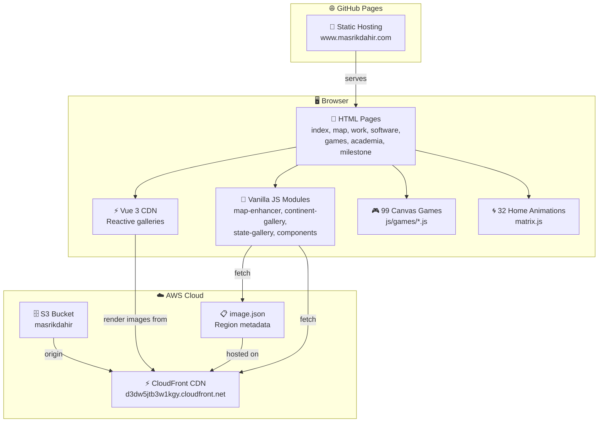
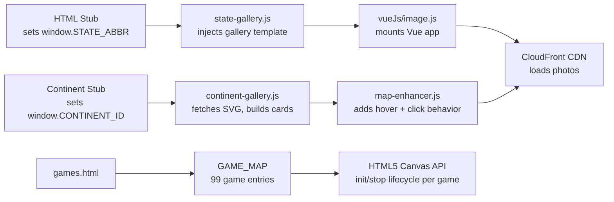
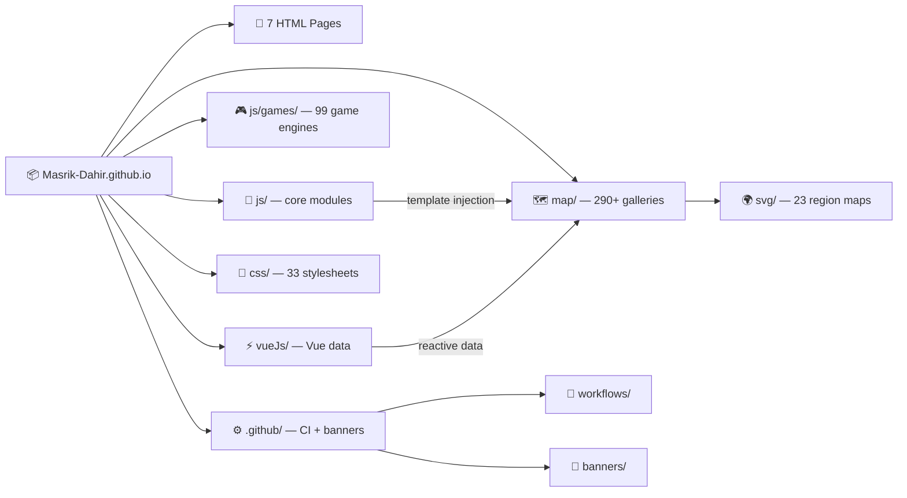
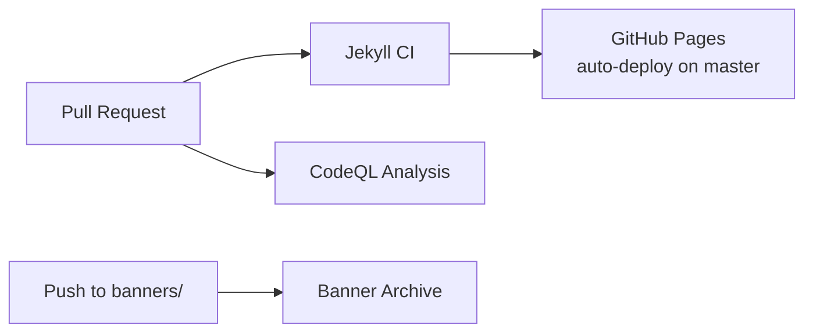

<!-- README auto-maintained. Update this file whenever: code structure changes,
     new env vars added, commands change, new workflows added, or deps updated. -->

> Software engineer building developer tools, AWS-heavy backends, and interactive web experiences. Open to roles and collaboration.

<div align="center">

*— project —*

<!-- Project Banner: pixel-arcade-cascade -->
<a href="https://www.masrikdahir.com">

</a>

*— author —*

<!-- Author Banner: bioluminescent-reef-pulse -->
<a href="https://www.masrikdahir.com">

</a>

> A static portfolio, 290-region travel atlas, and 99-game retro arcade — zero build step, zero server

[](https://github.com/Masrik-Dahir/Masrik-Dahir.github.io/actions/workflows/jekyll.yml)
[](https://github.com/Masrik-Dahir/Masrik-Dahir.github.io/actions/workflows/codeql-analysis.yml)
[](https://creativecommons.org/licenses/by-nc-sa/4.0/)
[](https://developer.mozilla.org/en-US/docs/Web/JavaScript)
[](https://developer.mozilla.org/en-US/docs/Web/API/Canvas_API)

</div>

<p align="center">
  
</p>

## ⚡ TL;DR

- **What:** A fully static personal website with a portfolio, interactive SVG world map covering 290+ regions, and 99 playable HTML5 Canvas retro arcade games — from Pac-Man to OutRun.
- **Who:** Anyone curious about Masrik Dahir's work, travel photography, or software projects, or anyone who wants to play classic arcade games in a browser.
- **Why:** Zero build step, zero server, zero dependencies beyond a CDN — pure HTML/CSS/JS with Vue 3 CDN and AWS CloudFront media, making it instantly forkable and deployable on GitHub Pages.
- **Start:** `git clone https://github.com/Masrik-Dahir/Masrik-Dahir.github.io.git && python -m http.server 8000` — open `http://localhost:8000` and you're browsing.
- **Know:** Photos are hosted on AWS S3/CloudFront (not in the repo), so gallery images require the S3 bucket to be populated; games work fully offline.

---

## 📋 Table of Contents

- [⚡ TL;DR](#-tldr)
- [✨ Features](#-features)
- [🏗️ Architecture](#️-architecture)
- [📁 Project Structure](#-project-structure)
- [⚙️ Prerequisites](#️-prerequisites)
- [🚀 Quick Start](#-quick-start)
- [📖 Usage](#-usage)
- [🔄 CI/CD](#-cicd)
- [🤝 Contributing](#-contributing)
- [📄 License](#-license)
- [📝 Changelog](#-changelog)

---

## ✨ Features

- 🗺️ **Interactive SVG World Map** — 23 SVG region maps with click-to-navigate and hover-to-preview flag thumbnails via dynamic pattern fills
- 📸 **290+ Photo Galleries** — Individual region pages with gallery grid and slideshow view modes powered by Vue 3
- 🎮 **99 Playable Retro Games** — Full arcade collection including Space Invaders, Pac-Man, Tetris, Snake, Galaga, OutRun, Pole Position, Scramble, Tank, and 90 more — all playable with keyboard and mobile touch controls
- 🏎️ **Pseudo-3D Racing Games** — OutRun and Pole Position with segment-based road rendering, curves, hills, scenery sprites, and detailed rear-view car graphics
- ⚙️ **Dynamic Template Engine** — `continent-gallery.js` and `state-gallery.js` inject gallery layouts from lightweight HTML stubs without any build step
- 🌐 **CloudFront CDN Media Delivery** — All images and thumbnails served through AWS CloudFront for fast global access
- 🧭 **Responsive Navigation** — Shared navbar and footer injected via `components.js` across all pages with active-page highlighting
- 💼 **Portfolio Sections** — Work experience timeline, academic history, software project showcase, and personal milestones
- 🎨 **Per-Game Canvas Previews** — Each game card in the gallery shows a unique auto-playing canvas animation (diving aliens, falling blocks, bouncing ball, etc.)
- 🚀 **Zero Build, Zero Server** — Entirely static — clone and serve with any HTTP server, deploy instantly on GitHub Pages

---

## 🏗️ Architecture



### Page Rendering Flow



---

## 📁 Project Structure

```
📦 Masrik-Dahir.github.io/
├── 📄 index.html               # Home / landing page
├── 📄 work.html                # Work experience timeline
├── 📄 academia.html            # Academic history
├── 📄 software.html            # Software project showcase
├── 📄 milestone.html           # Personal milestones
├── 📄 map.html                 # Interactive world map hub
├── 📄 games.html               # 99 playable retro arcade games
│
├── 📁 map/                     # 290+ region gallery pages
│   ├── 📁 svg/                 # 23 interactive SVG region maps
│   │   ├── usa.svg
│   │   ├── canada.svg
│   │   ├── northern_europe.svg
│   │   └── ...
│   ├── northamerica.html       # Continent gallery stubs
│   ├── europe.html
│   ├── africa.html
│   ├── ak.html                 # Individual region galleries
│   ├── wash.html
│   └── ... (335 pages)
│
├── 📁 js/                      # Core JavaScript modules
│   ├── 🔧 components.js        # Shared navbar + footer injection
│   ├── 🔧 continent-gallery.js # Dynamic continent page builder
│   ├── 🔧 state-gallery.js     # Region gallery template engine
│   ├── 🔧 map-enhancer.js      # SVG map hover/click behavior
│   ├── 🔧 aesthetics.js        # Visual effects
│   ├── 🔧 matrix.js            # 32 auto-playing retro game animations
│   ├── 🔧 map.js               # Map page utilities
│   └── 📁 games/               # 99 individual game engines
│       ├── 🎮 space-invaders.js
│       ├── 🎮 pacman.js
│       ├── 🎮 tetris.js
│       ├── 🎮 outrun.js
│       ├── 🎮 pole-position.js
│       ├── 🎮 scramble.js
│       ├── 🎮 tank.js
│       └── ... (99 total .js files)
│
├── 📁 vueJs/                   # Vue component data
│   ├── ⚡ image.js              # Gallery/slideshow Vue apps
│   ├── ⚡ software.js           # Software project cards
│   ├── ⚡ academia.js           # Academia page data
│   ├── ⚡ work.js               # Work page data
│   └── ⚡ default.js            # Shared Vue utilities
│
├── 📁 css/                     # Stylesheets
│   ├── 🎨 default.css          # Base styles
│   ├── 🎨 glowing.css          # Glowing button hover effects
│   ├── 🎨 map.element.css      # SVG map element styles
│   ├── 🎨 state-gallery.css    # Gallery layout
│   ├── 🎨 vintage.css          # Vintage theme
│   └── ... (33 CSS files)
│
├── 📁 library/                 # Vendored third-party libraries
│   └── vue@3.2.36.dist.vue.global.js
│
├── 📁 bootstrap/               # Bootstrap JS dependencies
│
├── 📁 tests/                   # Playwright + game test suites
│   └── test_games.html         # Physics, difficulty, winnability tests
│
├── 📁 .github/
│   ├── 📁 workflows/           # CI/CD pipelines
│   │   ├── jekyll.yml
│   │   ├── codeql-analysis.yml
│   │   ├── banner-archive.yml
│   │   └── laravel.yml
│   ├── 📁 banners/             # Animated SVG author/project banners
│   ├── 📁 screenshots/         # Hero SVG mockup
│   └── ⚙️ dependabot.yml
│
├── 🌐 CNAME                    # Custom domain: www.masrikdahir.com
├── 📄 LICENSE                   # CC BY-NC-SA 4.0
├── 📄 CHANGELOG.md
├── 📄 CODE_OF_CONDUCT.md
└── 📄 SECURITY.md
```



---

## ⚙️ Prerequisites

Before you begin, make sure you have the following installed:

| Tool | Version | Install |
|------|---------|---------|
| Any HTTP server | Any | Python 3 (`python -m http.server`), Node.js (`npx serve`), or VS Code Live Server |
| Git | Any | [git-scm.com](https://git-scm.com) |
| AWS CLI *(optional, for media uploads)* | >= 2.x | [aws.amazon.com/cli](https://aws.amazon.com/cli/) |

> 💡 **Tip:** No build step, no package manager, no bundler required. The site runs as pure static files.

---

## 🚀 Quick Start

### 1. Clone the repository

```bash
git clone https://github.com/Masrik-Dahir/Masrik-Dahir.github.io.git
cd Masrik-Dahir.github.io
```

### 2. Serve with any static file server

```bash
# Python
python -m http.server 8000

# Node.js
npx serve .

# VS Code Live Server extension
# Right-click index.html -> "Open with Live Server"
```

### 3. Open in your browser

```
http://localhost:8000
```

Navigate to the **Travel Map** page to explore the interactive SVG maps and photo galleries, or head to the **Games** tab to play any of the 99 retro arcade games.

---

## 📖 Usage

### Playing Games

1. Navigate to the **Games** tab in the top navigation
2. Browse the gallery of 99 games — each card shows a unique auto-playing canvas preview
3. Click any game card to launch it full-screen
4. Use **Arrow keys** or **WASD** to play; press **Enter**, **Space**, or tap to start
5. On mobile, use the on-screen touch buttons (D-pad + action buttons)

### Game Highlights

| Game | Genre | Controls |
|------|-------|----------|
| OutRun | Pseudo-3D Racing | Arrows/WASD — steer, accelerate, brake |
| Pole Position | F1 Racing | Arrows/WASD — steer, accelerate, brake |
| Pac-Man | Maze Chase | Arrows — move through maze, eat pellets |
| Space Invaders | Shoot-em-up | Arrows + Space — move and fire |
| Tetris | Puzzle | Arrows — move/rotate, Down — soft drop |
| Scramble | Side-scroller | Arrows + Space — fly and bomb |
| Tank | Maze Combat | Arrows + Space — navigate maze and fire |

### Browsing the Travel Map

1. Click **Map** in the navigation
2. Click a continent to zoom into its SVG region map
3. Hover over visited regions to see flag thumbnails and photo counts
4. Click a region to open its full photo gallery with slideshow mode

### Adding a New Region Gallery

1. **Upload photos** to S3:
   ```bash
   aws s3 cp ./photos/ s3://masrikdahir/{RegionName}/ --recursive --content-type image/jpeg
   aws s3 cp thumbnail.png "s3://masrikdahir/Thumbnail/{RegionName}/img.png" --content-type image/png
   ```

2. **Create the HTML page** at `map/{code}.html` (use any existing page as a template):
   - Set `window.STATE_ABBR = '{code}'`
   - Set the page title to `"Masrik Dahir - {Region Name}"`
   - Set the favicon to the CloudFront thumbnail URL

3. **Update `image.json`** on S3 to include the new region with `name`, `abbreviation`, `numImages`, and `isActive` fields.

4. **Invalidate CloudFront cache**:
   ```bash
   aws cloudfront create-invalidation --distribution-id E2NCS65HF57SMX --paths "/*"
   ```

### Deployment

The site deploys automatically to GitHub Pages on push to `master`. The custom domain `www.masrikdahir.com` is configured via the `CNAME` file.

---

## 🔄 CI/CD

This project uses GitHub Actions for automated validation and security analysis.

| Workflow | File | Trigger | Purpose |
|----------|------|---------|---------|
| Jekyll CI | `jekyll.yml` | Push / PR | Site build validation |
| CodeQL | `codeql-analysis.yml` | Push / PR / schedule | Security analysis |
| Banner Archive | `banner-archive.yml` | Push to banners / README | Validate and archive SVG banners |

### Pipeline Flow



> All checks must pass before merging. See [`.github/workflows/`](.github/workflows/) for full configuration.

---

## 🤝 Contributing

Contributions are welcome! Please follow these steps:

1. **Fork** the repository
2. **Create** a feature branch: `git checkout -b feat/amazing-feature`
3. **Commit** your changes: `git commit -m 'feat: add amazing feature'`
4. **Push** to the branch: `git push origin feat/amazing-feature`
5. **Open** a Pull Request

### Commit Convention

This project uses [Conventional Commits](https://www.conventionalcommits.org/):

| Prefix | Use for |
|--------|---------|
| `feat:` | New features |
| `fix:` | Bug fixes |
| `docs:` | Documentation only |
| `chore:` | Build / tooling changes |
| `test:` | Adding or fixing tests |

> Please ensure all checks pass before opening a PR.

---

## 📄 License

Distributed under the [Creative Commons Attribution-NonCommercial-ShareAlike 4.0 International License](https://creativecommons.org/licenses/by-nc-sa/4.0/).

You are free to:
- **Share** — copy and redistribute the material in any medium or format
- **Adapt** — remix, transform, and build upon the material

Under the following terms:
- **Attribution** — You must give appropriate credit
- **NonCommercial** — You may not use the material for commercial purposes
- **ShareAlike** — If you remix, transform, or build upon the material, you must distribute your contributions under the same license

---

## 📝 Changelog

| Version | Date | Changes |
|---------|------|---------|
| v3.0.0 | 2026-04-14 | Expanded to 99 playable games, fixed OutRun/Pole Position rendering, fixed Scramble terrain, fixed Tank maze connectivity, new banners, removed stats workflows |
| v2.2.0 | 2026-04-10 | Added Games tab with playable Night Racer pseudo-3D racing game, new banners |
| v2.1.0 | 2026-04-10 | Added 32 canvas retro game animations with shuffle, replaced 4 games, improved 8 games |
| v2.0.0 | 2026-04-10 | Full README rewrite with animated banners, hero screenshot, Mermaid diagrams |
| v1.0.0 | — | Initial README |

---

<div align="center">

Made with love by **[Masrik Dahir](https://www.masrikdahir.com)**

Star this repo if you find it helpful!

</div>
